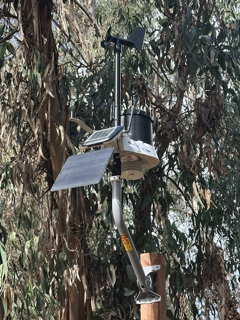
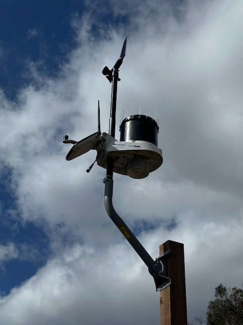

# Ellwood Weather Scraper

## Project Purpose

This repository archives weather data from two monitoring stations at Ellwood Mesa Open Space (Goleta, CA). The data collection supports the [Monarch Butterfly Habitat Management Plan Implementation Phase 1](https://www.cityofgoleta.org/play/parks-recreation-open-spaces/ellwood-mesa-and-monarch-butterfly-habitat/ellwood-improvement-projects/butterfly-habitat-plan-implementation).

**Key Monitoring Requirement:** Wind speeds must be less than 9 mph for 95% of measurements (taken every 15 minutes) within monarch butterfly sites.

## Weather stations

There are two cellularly enabled KestrelMet 6000 weather stations installed at Ellwood Mesa. One is located within the main grove, near the viewing area. The other is installed outside the grove, providing data to compare how the microclimate within the grove compares to the outside.

| Ellwood Main (Butterfly Grove)                                                                          | Ellwood Mesa (Reference)                                                                                |
| ------------------------------------------------------------------------------------------------------- | ------------------------------------------------------------------------------------------------------- |
|                                                                            |                                                                            |
| [Ambient Weather Network (Best)](https://ambientweather.net/dashboard/b4aaf46123aed035e752a9c6d12b4270) | [Ambient Weather Network (Best)](https://ambientweather.net/dashboard/20dc1ae4e73e07c0ab9ad164ebee448d) |
| [Weather Underground](https://www.wunderground.com/dashboard/pws/KCAGOLET176)                           | [Weather Underground](https://www.wunderground.com/dashboard/pws/KCAGOLET177)                           |
| [PWS Weather](https://www.pwsweather.com/station/pws/ellwoodmain)                                       | [PWS Weather](https://www.pwsweather.com/station/pws/ellwoodmesa)                                       |

## Data Archiving

### Automated Data Collection

The project uses automated data collection to maintain a complete historical record of weather observations. Here's how it works:

1. The `weather_scraper.py` script runs daily at 12:30 AM Pacific Time via GitHub Actions
2. The script:
   - Fetches data from the Ambient Weather Network API
   - Transforms the observations into a standardized format
   - Saves the previous day's data as a CSV file in the `data` directory
   - Automatically commits the new file to the repository

CSV files follow this naming pattern:
```{station_id}_{YYYY}_{MM}_{DD}.csv```

For workflow troubleshooting, refer to [GitHub Actions Setup](github_action_setup.md).

### Data Retention

This automation is crucial because Ambient Weather Network (AWN) has limited data retention:

- First 30 days: Complete 15-minute interval data
- 1-12 months: Reduced to 30-minute intervals
- After 12 months: Data is permanently deleted

By archiving daily CSVs in this repository, we maintain a complete historical record that would otherwise be lost.

## Alternative Data Sources

Both weather stations transmit data to multiple weather networks:
- Ambient Weather Network (primary data source)
- PWS Weather
- Weather Underground

While PWS Weather is designed for long-term data archiving, we've observed inconsistent data transmission to their platform. The records, though incomplete, can serve as a backup data source if needed.

Weather Underground also maintains historical records but has similar reliability limitations.

See the station links in the table above if you need to access these alternative data sources.

## Local Development Setup

If you need to work on this script locally, please follow the steps below:

1. Clone the repository:

   ```bash
   git clone https://github.com/kylenessen/ellwood-weather-scraper.git
   cd ellwood-weather-scraper
   ```

2. Install dependencies:

   ```bash
   pip install -r requirements.txt
   ```

3. Configure environment variables:
   - Create a `.env` file in the project root based on `.env.example`:

     ```
     # Ambient Weather Network API credentials
     API_KEY=your_ambient_weather_api_key_here
     APPLICATION_KEY=your_ambient_weather_application_key_here

     # Station MAC Addresses
     ELLWOOD_MAIN_MAC=XX:XX:XX:XX:XX:XX
     ELLWOOD_MESA_MAC=XX:XX:XX:XX:XX:XX
     ```

   - Get API credentials from your Ambient Weather account settings
   - Find MAC addresses in your Ambient Weather dashboard
   - For GitHub Actions, set these as repository secrets:
     - `API_KEY`
     - `APPLICATION_KEY`
     - `ELLWOOD_MAIN_MAC`
     - `ELLWOOD_MESA_MAC`
